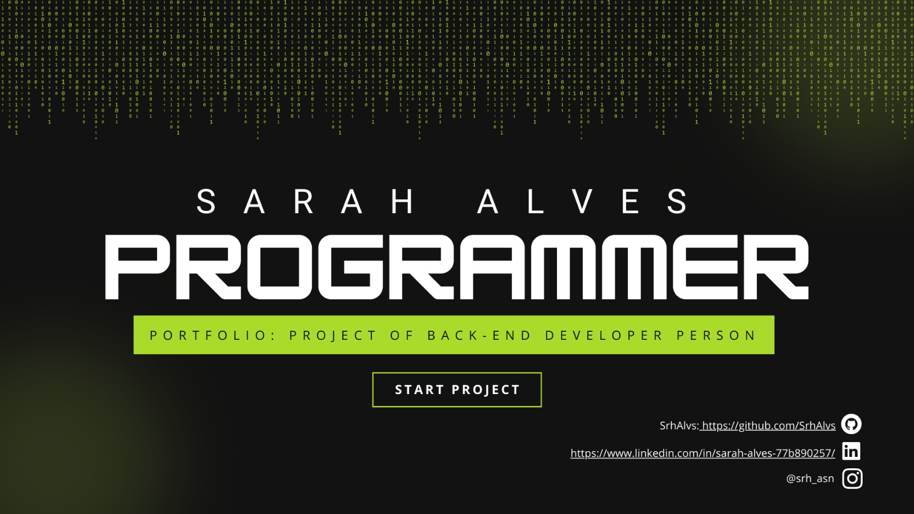

<h1 align="center">Project of Back-End Developer Person</h1>

### Description

 &nbsp; &nbsp; &nbsp; I plan to make this repository my "business card", so everything I learn and plan will be here! Thank you for your attention! 
Appreciate my work and give me stars ^-^ 

 
### Author

 &nbsp; &nbsp; &nbsp; Made with great dedication by Sarah Alves ♡ 

**- Contact me!**

 <a href="mailto:sssarahalves@gmail.com" title="E-mail">sssarahalves@gmail.com</a>

 <a href="https://www.linkedin.com/in/sarah-alves-77b890257/" title="LinkedIn">Sarah Alves</a>

 <a href="https://github.com/SrhAlvs" title="GitHub">Srh Alvs</a>

 <a href="https://www.instagram.com/srh_asn/" title="Instagram">@srh_asn</a>

#
#
#
#
<a href="https://www.flaticon.com/br/" title="Icons">--- icons by Freepik - Flaticon ---</a>